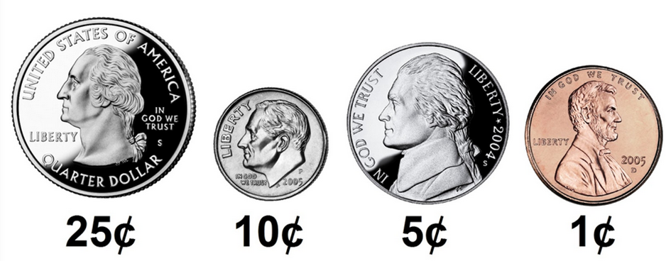

# Cash

If you make change, you probably want to minimize the number of coins you spend on each customer so you don't run out (or annoy the customer!). Fortunately, computer science has given cashiers everywhere ways to minimize the number of coins due: greedy algorithms.

According to the National Institute of Standards and Technology (NIST), a greedy algorithm is one "that always chooses the best immediate or local solution when searching for an answer. Greedy algorithms find the overall or globally optimal solution to some optimization problems, but may find less than optimal solutions to some instances of other problems."

What does it all mean? Let's say a cashier owes a customer some change and there are quarters (25¢), dimes (10¢), nickels (5¢) and pennies (1¢) in the cashier's drawer. The problem to be solved is to decide which coins and how many to give the customer. Think of a "greedy" cashier as someone who wants to get the biggest possible share of the problem with every coin they take out of the drawer. For example, if a customer is owed 41¢, the biggest first (i.e., best immediate or local) bite that can be taken is 25¢. (This bite is "best" in that it gets us closer to 0¢ faster than any other coin.) Note that a bite of this size would reduce the 41¢ problem to a 16¢ problem, since 41 - 25 = 16. That is, the rest is a similar but smaller problem. Of course, another 25¢ bite would be too big (assuming the cashier doesn't want to lose money), and so our greedy cashier would move on to a 10¢ bite, leaving him or her with a 6¢ problem. At this point, greed calls for a 5¢ bite, followed by a 1¢ bite, which solves the problem. The customer receives a quarter, a dime, a nickel and a penny, for a total of four coins.

It turns out that this greedy approach (i.e. algorithm) is not only optimal locally, but also globally for the American currency (and also for that of the European Union). That is, as long as a cashier has enough of each coin, this approach will yield the fewest possible number of coins from the largest to the smallest. How few? Well, you tell us!

## Implementation Details

In Cash, we have implemented most (but not all!) of a program that asks the user for the number of cents owed to a customer and then outputs the smallest number of coins that can be used to return change. In fact, main and the greedyAlgorithm function are already implemented for you. But note that greedyAlgorithm calls several functions that are not yet implemented! The functions all take one argument, an int, and also return an int. All of them currently return 0, so the code can be compiled. However, you should replace all TODO and return 0; with your own code. In particular, complete the implementation of these functions as follows:
- Implement `calculate_quarters` in such a way that the function calculates (and returns as an int) how many quarters a customer should be given if they’re owed some number of cents.
- Implement `calculate_dimes` in such a way that the function calculates the same for dimes.
- Implement `calculate_nickels` in such a way that the function calculates the same for nickels.
- Implement `calculate_pennies` in such a way that the function calculates the same for pennies.

Note that unlike functions that only have side effects, functions that return a value should do so explicitly with return! Make sure that you do not change the distribution code itself, but only replace the specified TODOs and the subsequent return value!

Also note that each of your calculation functions should accept any value of cents, not just the values that the greedy algorithm might suggest. For example, if cents is 85, calculate_dimes should return 8.

## How to Test Your Code

For this program, try testing your code manually–it’s good practice:
- If you input 0, does your program output 0?
- If you input 1, does your program output 1 (i.e., one penny)?
- If you input 4, does your program output 4 (i.e., four pennies)?
- If you input 5, does your program output 1 (i.e., one nickel)?
- If you input 24, does your program output 6 (i.e., two dimes and four pennies)?
- If you input 25, does your program output 1 (i.e., one quarter)?
- If you input 26, does your program output 2 (i.e., one quarter and one penny)?
- If you input 99, does your program output 9 (i.e., three quarters, two dimes, and four pennies)?
