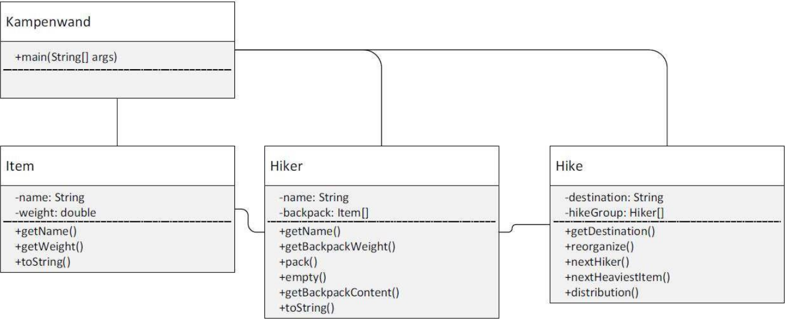

# Christmas Exercise 01 – Object-oriented programming

You are planning a hiking trip to Kampenwand with friends. You agree that everyone should bring something, and that the weight should be fairly allocated before you start the climb.

- **Peter** brings 5 bottles of water (1.5kg each), ham sandwiches (500g) and his jacket (1.5kg)
- **Max** brings cheese sandwiches (700g), chocolate (300g) and his jacket (1kg)
- **Sabine** brings apples (500g), a blanket (2kg) and her jacket (1kg)
- **Gerda** brings bananas (500g), a frisbee (200g) and her jacket (700g)
- **At the last minute**, a lazybones signs up to come along, but doesn’t bring anything (except for an empty rucksack).

The redistribution of luggage means that each participant first empties their backpack and then takes it in turns to put the next heavier piece of luggage into the next lighter rucksack. Write a program that outputs the luggage distribution among the hikers before the redistribution, then redistributes the luggage fairly and finally outputs the new luggage distribution.

The following class diagram reflects the classes and their relationships:



**Task 1:** Work out the substantive task for the respective methods.

**Task 2:** Describe the algorithm for the redistribution. The basic idea is based on a greedy algorithm.

**Task 3:** Implement the classes: Item, Hiker and Hike with the attributes and methods given in the class diagram, along with the redistribution algorithm developed. The class Kampenwand is already fully implemented.

**Task 4:** Create the example output listed below.

Notes:
- In principle, you are already familiar with the search for the next-lightest (next-heaviest) backpack (luggage item); what’s new here is that you need to add or remove elements in an array. To do so, revisit the sections on Fields and Non-primitive (reference) data types.
- If a hiker should pack a luggage item, but the backpack is implemented as an array, you must first create a new array, which is bigger than the old one, copy all the old elements into the new array, and then add the new element at the end.


## Testcases

**Input:**
1

**Output:**
item distribution across the backpacks with the destination Kampenwand:
- Peter: Water, Water, Water, Water, Water, Sandwich, Jacket (9.5 kg)
- Sabine: Apples, Jacket, Blanket (3.5 kg)
- Gerda: Bananas, Jacket, Frisbee (1.4 kg)
- Max: Cheese Sandwich, Jacket, Chocolate (2.0 kg)
- Lazy: no items in backpack

Reorganized Weight from 16.4 kg to 5 hikers.
- Peter takes along Blanket with 2.0 kg.
- Sabine takes along Water with 1.5 kg.
- Gerda takes along Water with 1.5 kg.
- Max takes along Water with 1.5 kg.
- Lazy takes along Water with 1.5 kg.
- Sabine takes along Water with 1.5 kg.
- Gerda takes along Jacket with 1.5 kg.
- Max takes along Jacket with 1.0 kg.
- Lazy takes along Jacket with 1.0 kg.
- Peter takes along Jacket with 0.7 kg.
- Max takes along Cheese Sandwich with 0.7 kg.
- Lazy takes along Sandwich with 0.5 kg.
- Peter takes along Apples with 0.5 kg.
- Sabine takes along Bananas with 0.5 kg.
- Gerda takes along Chocolate with 0.3 kg.
- Lazy takes along Frisbee with 0.2 kg.

item distribution across the backpacks with the destination Kampenwand:
- Peter: Blanket, Jacket, Apples (3.2 kg)
- Sabine: Water, Water, Bananas (3.5 kg)
- Gerda: Water, Jacket, Chocolate (3.3 kg)
- Max: Water, Jacket, Cheese Sandwich (3.2 kg)
- Lazy: Water, Jacket, Sandwich, Frisbee (3.2 kg)


```java
import java.util.Scanner;

public class Kampenwand {
    public static void main(String[] args) {
        Scanner scanner = new Scanner(System.in);
        int testcase = scanner.nextInt();
        if (testcase == 1) {
            Hiker peter = new Hiker("Peter", new Item[]{
                new Item("Water", 1.5),
                new Item("Water", 1.5),
                new Item("Water", 1.5),
                new Item("Water", 1.5),
                new Item("Water", 1.5),
                new Item("Sandwich", 0.5),
                new Item("Jacket", 1.5)
            });
            Hiker max = new Hiker("Max", new Item[]{
                new Item("Cheese Sandwich", 0.7),
                new Item("Jacket", 1.0),
                new Item("Chocolate", 0.3)
            });
            Hiker sabine = new Hiker("Sabine", new Item[]{
                new Item("Apples", 0.5),
                new Item("Jacket", 1.0),
                new Item("Blanket", 2.0)
            });
            Hiker gerda = new Hiker("Gerda", new Item[]{
                new Item("Bananas", 0.5),
                new Item("Jacket", 0.7),
                new Item("Frisbee", 0.2)
            });
            Hiker lazy = new Hiker("Lazy", new Item[0]);
            Hike kampenwand = new Hike("Kampenwand", new Hiker[]{
                peter,
                sabine,
                gerda,
                max,
                lazy
            });
            System.out.println();
            kampenwand.distribution(); // previous state
            System.out.println();
            kampenwand.reorganize(); // Greedy - redistribution
            System.out.println();
            kampenwand.distribution(); // post state
        } else if (testcase == 2) {
            Hiker peter = new Hiker("Peter", new Item[]{
                new Item("Blanket", 2.0),
                new Item("Jacket", 0.7),
                new Item("Apples", 0.5)
            });
            Hike simsee = new Hike("Simsee", new Hiker[]{peter});
            System.out.println();
            simsee.distribution();
            System.out.println();
            simsee.reorganize();
            System.out.println();
            simsee.distribution();
        }
    }
}
```