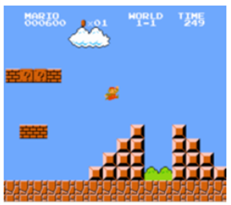
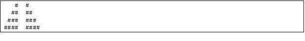
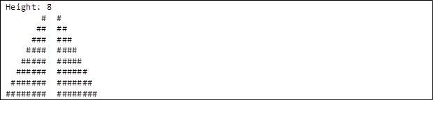
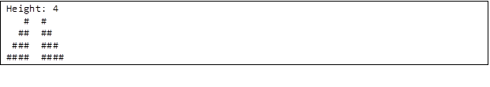
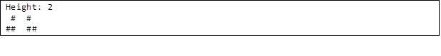
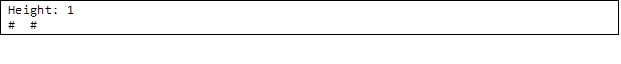

# Mario

Toward the beginning of World 1-1 in Nintendo’s Super Mario Brothers, Mario must hop over adjacent pyramids of blocks, per the below.



Let's recreate these pyramids in Java, albeit in text form, using hashes (#) as building blocks, as shown below. Each hash is a little taller than it is wide, so the pyramids themselves are also taller than they are wide.



The class we’ll write will be called `Mario`. And let’s allow the user to decide just how tall the pyramids should be by first prompting them for a positive integer between, 1 and 8, inclusive.

Here’s how the program might work if the user inputs 8 when prompted:




Here’s how the program might work if the user inputs 4 when prompted:



Here’s how the program might work if the user inputs 2 when prompted:



And here’s how the program might work if the user inputs 1 when prompted:



If the user doesn’t input a positive integer between 1 and 8, inclusive, the program should only print “Height: number”.

Notice that the width of the “gap” between adjacent pyramids is equal to the width of two hashes, irrespective of the pyramids’ heights.

If you want a video walkthrough, check this link. But do mind, the language used there is C, not Java. The biggest difference is that `printf()` translates to `System.out.print()`:
[https://www.youtube.com/watch?v=FzN9RAjYG_Q](https://www.youtube.com/watch?v=FzN9RAjYG_Q)

```java
import java.util.Scanner;

public class Mario 
{
    public static void main(String[] args)
    {
        Scanner scanner = new Scanner(System.in);
        int number_tests = scanner.nextInt();

        for (int i = 0; i < number_tests; i++) 
        {
            int number = scanner.nextInt();
            mario(number);
        }
    }

    public static void mario(int number)
    {
        //TODO
    }
}
