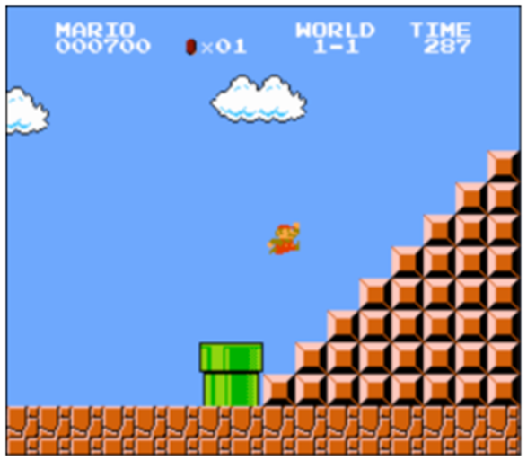
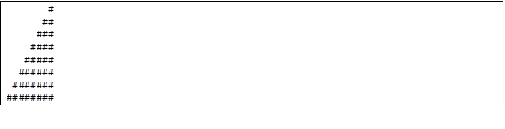
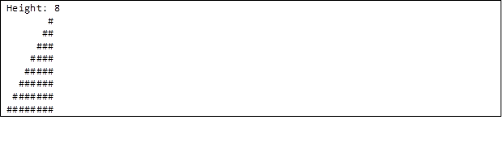
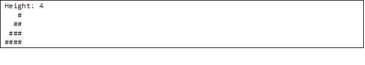
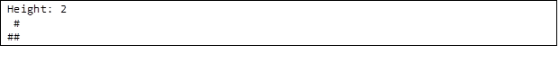
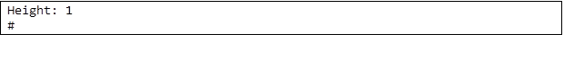
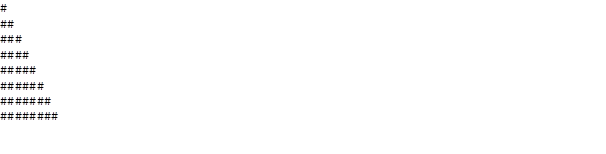
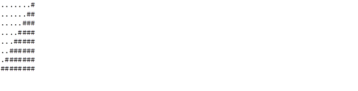
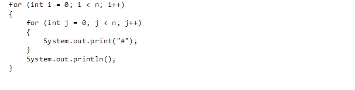

# Mario Lite

Toward the end of World 1-1 in Nintendo’s Super Mario Brothers, Mario must ascend a right-aligned pyramid of blocks, a la the below.



Let’s recreate that pyramid in Java, albeit in text, using hashes (#) for bricks, a la the below. Each hash is a bit taller than it is wide, so the pyramid itself will also be taller than it is wide.



The class we’ll write will be called `Mario`. And let’s allow the user to decide just how tall the pyramid should be by first prompting them for a positive integer between, 1 and 8, inclusive.

Here’s how the program might work if the user inputs 8 when prompted:



Here’s how the program might work if the user inputs 4 when prompted:



Here’s how the program might work if the user inputs 2 when prompted:



And here’s how the program might work if the user inputs 1 when prompted:



If the user doesn’t, in fact, input a positive integer between 1 and 8, inclusive, the program should only print “Height: number”.

If you want a video walkthrough, check this link. But do mind, the language used there is C, not Java. The biggest difference is that `printf()` translates to `System.out.print()`:
[https://www.youtube.com/watch?v=NAs4FIWkJ4s](https://www.youtube.com/watch?v=NAs4FIWkJ4s)

```java
import java.util.Scanner;

public class MarioLite 
{
    public static void main(String[] args)
    {
        Scanner scanner = new Scanner(System.in);
        int number_tests = scanner.nextInt();

        for (int i = 0; i < number_tests; i++) 
        {
            int number = scanner.nextInt();
            marioLite(number);
        }
    }

    public static void marioLite(int number)
    {
        //TODO
    }
}
```
## Pseudocode

Before you start, it might be helpful to think about Pseudocode that would solve the problem. Check below for Hint #1 if you need additional help.

**Print out Input**

The given Java code reads the input from the testcases we give it. Your first task is to print out the number it receives, so the terminal looks like “Height: 3” for the input 3.

**Building the Opposite**

It turns out it’s a bit easier to build a left-aligned pyramid than right-aligned, a la the below. 



So let’s build a left-aligned pyramid first and then, once that’s working, right-align it instead! Modify your code such that it no longer simply prints the user’s input but instead prints a left-aligned pyramid of that height. Hint #2 provides more help on how might go about this.

**Right-Aligning with Dots**

Let’s now right-align that pyramid by pushing its hashes to the right by prefixing them with dots (i.e., periods), a la the below. 



Modify your code in such a way that it does exactly that! Hint #3 might give you a good idea on how to do this.

**Removing the Dots**

All that remains now is a finishing flourish! Modify your code in such a way that it prints spaces instead of those dots!

## Hint #1

There's more than one way to do this, so here's just one!
1. If height is less than 1 or greater than 8 (or not an integer at all), go back one step
2. Iterate from 1 throught height
   - On iteration i, print i hashes and then a new line

## Hint #2

- Keep in mind that a hash is just a character like any other, so you can print it with `System.out.print()`. If you want to add a line between each print, use `System.out.println()` instead.
- Java has a for loop, via which you can iterate some number times. Perhaps on each iteration, i, you could print that many hashes?
- You can actually “nest” loops, iterating with one variable (e.g., i) in the “outer” loop and another (e.g., j) in the “inner” loop. For instance, here’s how you might print a square of height and width n, below. Of course, it’s not a square that you want to print!



## Hint #3

Notice how the number of dots needed on each line is the “opposite” of the number of that line’s hashes. For a pyramid of height 8, like the above, the first line has but 1 hash and thus 7 dots. The bottom line, meanwhile, has 8 hashes and thus 0 dots. Via what formula (or arithmetic, really) could you print that many dots?

